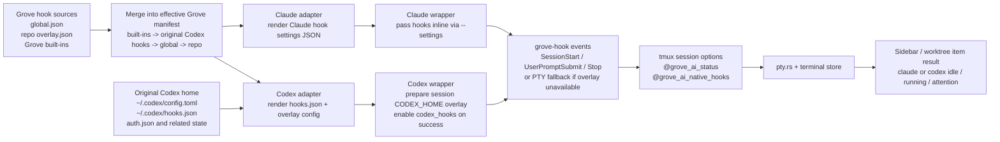

# Grove Hooks Runtime for Claude/Codex Parity

**Date**: 2026-03-28

## Summary

Introduce a Grove-managed hooks runtime that produces the same Grove-visible lifecycle signals for Claude Code and Codex while also opening a public user-extensible hook interface.

The immediate product goal is narrow: keep worktree AI state indicators accurate in the sidebar. The runtime exists to support that goal first. It must also be designed so user-defined hooks can be layered on later without reworking the core delivery model.

The key delivery constraint is no repository or git trace for Grove-managed hooks. Claude already satisfies this via inline `--settings`. Codex must match that standard as closely as possible by using a session-specific `CODEX_HOME` overlay instead of writing repo-local `.codex/hooks.json`.

## Runtime Flow



## Current State

### Sidebar status flow

- `grove-core/src/pty.rs` stores AI activity in tmux session option `@grove_ai_status`
- `src/components/terminal/TerminalPanel.tsx` polls `pollPtyBells()`
- `src/store/terminal.ts` parses raw `tool:status`
- `src/components/sidebar/worktree-status.ts` gathers PTY statuses per worktree
- `src/components/sidebar/WorktreeItem.tsx` renders Claude/Codex icons and animations

### Wrapper behavior today

- `grove-core/src/tool_hooks.rs` installs `~/.grove/bin/claude`, `~/.grove/bin/codex`, and `~/.grove/bin/grove-hook`
- Claude wrapper injects inline hook JSON with `--settings`
- Codex wrapper only sets lifecycle trap state and relies on `pty.rs` idle timeout heuristics
- `pty.rs` treats Codex as hookless via `HOOKLESS_TOOLS = ["codex"]`

### Problems

1. Claude and Codex do not produce the same quality of status signal.
2. Codex status is inferred from PTY output instead of explicit lifecycle events.
3. There is no Grove-owned public hook model; Claude hooks are hardcoded, Codex has no native Grove integration.
4. A repo-local Codex hooks file would solve delivery but violates the preferred "leave no repo/git trace" behavior.

## Requirements

### Functional

- Keep `@grove_ai_status` as the Grove-internal contract.
- Produce explicit lifecycle status updates for both Claude and Codex.
- Support Grove built-in status hooks and user-defined hooks in the same runtime.
- Merge hooks from multiple layers:
  - original Codex home hooks if present
  - Grove global hooks
  - Grove repo hooks
  - Grove built-in hooks
- Preserve backend-specific capabilities without exposing backend-native config as the public authoring model.

### Delivery and persistence

- Do not write Grove-managed hook source files into the repo.
- Do not require `.codex/hooks.json` in the worktree as the normal path.
- Use a session-specific Codex overlay root so different worktrees can run different effective hooks at the same time.
- Clean up stale session overlay roots reliably on exit and on Grove startup.

### Extensibility

- Publish a Grove manifest format in JSON.
- Allow multiple hooks on the same event.
- Use deterministic ordering when rendering effective hooks.
- Keep built-in Grove status hooks non-removable in v1.

## Design

### 1. Public authoring model

Grove owns a public manifest schema that is independent from Claude or Codex native hook formats.

Storage:

- global manifest: `~/.grove/hooks/global.json`
- repo overlay manifest: `~/.grove/hooks/repos/<repo-key>.json`

The repo key should reuse Grove's existing project identity model based on host/org/repo rather than raw path strings.

Manifest shape:

```json
{
  "version": 1,
  "hooks": [
    {
      "id": "user.log-prompt",
      "event": "user_prompt_submit",
      "enabled": true,
      "matcher": {
        "tool_name": "Bash"
      },
      "handlers": [
        {
          "type": "command",
          "command": "/path/to/script.sh"
        }
      ]
    }
  ]
}
```

`matcher` accepts either a plain string pattern or a structured object such as
`{ "tool_name": "Bash", "pattern": "git push" }`. Backend adapters may flatten
or drop matcher fields when the target runtime only supports string matchers.

Public Grove events:

- `session_start`
- `user_prompt_submit`
- `stop`
- `stop_failure`
- `notification`
- `pre_tool_use`
- `post_tool_use`
- `session_end`

Not every backend supports every event with the same fidelity. Backend adapters are responsible for capability filtering.

### 2. Effective hook rendering

Grove does not persist a fully merged manifest. It renders an effective runtime config at session start from layered inputs.

Render order within each event:

1. Grove built-in hooks
2. original Codex home hooks
3. Grove global hooks
4. Grove repo hooks

This is append-based event composition, not key-replacement-based composition. Multiple handlers on the same event are expected. `id` is retained for diagnostics and future targeted disable/update behavior, but event-array composition is the primary merge rule.

### 3. Grove built-in hooks

Grove built-in hooks are reserved for session status updates and are always present.

Examples:

- `grove.status.session_start`
- `grove.status.user_prompt_submit`
- `grove.status.stop`
- `grove.status.notification`
- `grove.status.session_end`

These hooks resolve to `grove-hook <tool> <event>` commands and update `@grove_ai_status`.

In v1:

- built-ins are not user-disableable
- built-ins are always rendered first for their event

This guarantees worktree sidebar status remains correct even if user hooks are slow or fail.

### 4. Claude delivery

Claude stays on the existing inline delivery path.

Flow:

1. Load Grove global and repo manifests.
2. Prepend built-in status hooks.
3. Render Claude-native hook JSON.
4. Pass it inline through the wrapper using `--settings`.

This preserves the current "no repo trace" behavior and removes the need for hardcoded Claude hook JSON inside `tool_hooks.rs`.

### 5. Codex delivery

Codex must not rely on repo-local `.codex/hooks.json` as the primary delivery path.

Flow:

1. Create a session-specific overlay root:
   `~/.grove/runtime/codex/<session-id>/`
2. Read original `~/.codex/config.toml`
3. Read original `~/.codex/hooks.json` if it exists
4. Merge original hooks + Grove effective hooks
5. Materialize overlay files:
   - `config.toml`
   - `hooks.json`
6. Link or copy required user-state inputs:
   - `auth.json` required
   - `skills`, `plugins`, `rules`, `vendor_imports` as needed
7. Launch Codex with:
   - `CODEX_HOME=<overlay-root>`
   - `--enable codex_hooks`

This preserves login state, avoids repo writes, and allows concurrent session-specific hook configurations.

If the original Codex home already contains `hooks.json`, Grove must preserve it. The wrapper may only enable the overlay path when it can successfully merge original hooks with Grove built-ins and overlays. If no merge-capable interpreter is available, Grove warns and falls back to the original `CODEX_HOME` rather than silently dropping user hooks.

### 6. Cleanup

Codex overlay roots are disposable runtime artifacts.

Cleanup responsibilities:

- wrapper trap removes the overlay root on normal process exit
- wrapper records an owner pid marker so startup cleanup can identify stale overlays
- Grove startup removes stale `~/.grove/runtime/codex/*` entries that no live wrapper owns
- cleanup must tolerate partially created roots and failed deletions

The overlay must be treated like PTY/tmux runtime state, not like project config.

### 7. Fallback behavior

Codex hook delivery should not make Grove less robust.

If Codex hook rendering or overlay setup fails:

- wrapper logs a warning
- Codex still launches from the original `CODEX_HOME`
- `pty.rs` idle heuristic remains as fallback

That means `HOOKLESS_TOOLS = ["codex"]` cannot simply disappear. It should instead become conditional fallback behavior when explicit hook delivery is unavailable.

### 8. Backend capability matrix

The public manifest is wider than any one backend.

Examples:

- Codex supports file-based hooks with `codex_hooks` feature enabled
- Claude currently uses inline hook config via `--settings`
- Tool-level events may vary by backend and matcher semantics

Adapters must:

- render supported events
- omit unsupported events safely
- surface warnings for hooks that were dropped

The public interface should be Grove-centric. Backend-specific limitations belong in diagnostics, not in authoring format.

## Architecture

### New Rust modules

- `hook_manifest.rs`
  JSON schema types and loader helpers
- `hook_merge.rs`
  layer merge and event ordering
- `hook_render_claude.rs`
  Claude adapter renderer
- `hook_render_codex.rs`
  Codex adapter renderer
- `hook_runtime.rs`
  session runtime assembly, including Codex overlay creation and cleanup

### Existing module changes

- `tool_hooks.rs`
  replace hardcoded wrapper payload generation with runtime-backed rendering
- `pty.rs`
  keep hookless fallback but stop treating Codex as permanently hookless
- `process_env.rs`
  may need helper support for wrapper environment construction

## Error Handling

- malformed Grove manifest: ignore layer, log warning, continue with remaining layers
- malformed original `~/.codex/hooks.json`: log warning, continue with Grove-only hooks in overlay
- overlay materialization failure: launch Codex without overlay and fall back to heuristic tracking
- cleanup failure: log warning and leave stale dir for startup cleanup

## Testing

### Unit tests

- manifest JSON parse
- merge ordering per event
- Claude render from merged effective config
- Codex render from merged effective config
- built-in hooks always first
- original Codex hooks merged, not replaced

### Integration-style tests

- overlay root created with copied `config.toml` and linked `auth.json`
- wrapper script contains `CODEX_HOME` setup and cleanup trap
- wrapper only enables native Codex hooks after overlay preparation succeeds
- fallback still works when overlay assembly fails

## Out of Scope

- full Grove UI for managing hooks
- user-disableable Grove built-in hooks
- backend-independent guarantee for every advanced tool matcher
- migration of existing user auth/session/state data into long-lived Grove-owned roots
