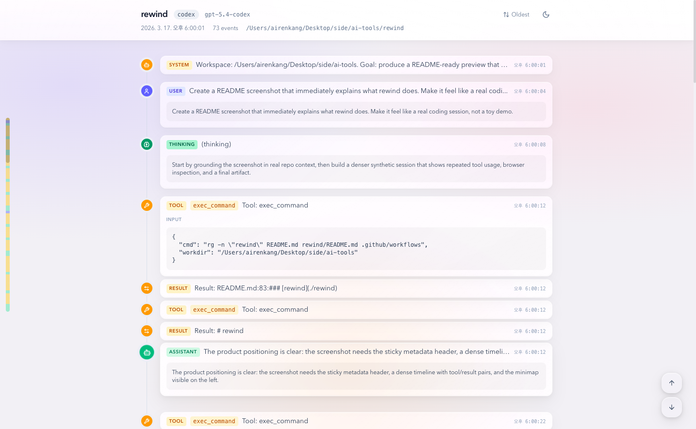

# rewind

Visual timeline viewer for Claude Code and Codex session transcripts. It finds a local session file, parses it into normalized events, then opens an interactive browser UI for inspection.

<p align="center">
  
</p>

## Install

### CLI

```bash
curl -fsSL https://raw.githubusercontent.com/bang9/ai-tools/main/rewind/install.sh | bash
```

### Plugin

Installs the `rewind` CLI automatically in Claude Code sessions:

```bash
/plugin marketplace add bang9/ai-tools
/plugin install rewind
```

## Quick Start

```bash
# Claude Code session
rewind claude <session-id>

# Codex session
rewind codex <session-id>

# Use an explicit session file to skip auto-discovery
rewind codex --path ~/.codex/sessions/2026/03/11/run-abc12345.jsonl

# Export the static viewer without opening a browser automatically
rewind codex <session-id> --no-open

# Remove stale exported viewers from the cache directory
rewind cleanup
```

`rewind` searches for the matching session file locally, exports a self-contained viewer bundle to `~/.rewind/viewers`, and opens the timeline in your browser.

Discover commands: `rewind --help`

## Supported Session Sources

- `claude`: looks for `~/.claude/projects/*/<session-id>.jsonl`
- `codex`: looks for `~/.codex/sessions/YYYY/MM/DD/*-<session-id>.jsonl`

## What It Shows

- User and assistant messages
- Tool calls and tool results
- Reasoning / thinking summaries
- Session metadata such as backend, model, cwd, start time, and event count
- Interactive timeline features including sort toggle, minimap, and expandable event content

## Commands

| Command | Description |
|---------|-------------|
| `rewind <backend> <session-id> [--no-open]` | Parse a discovered session and open the browser timeline |
| `rewind <backend> --path <session-file.jsonl> [--no-open]` | Parse an explicit session file without auto-discovery |
| `rewind cleanup` | Delete stale exported viewer directories from `~/.rewind/viewers` |
| `rewind version` | Print the current version |
| `rewind upgrade` | Upgrade to the latest release |

## Viewer Export

Each launch writes a static viewer bundle to `~/.rewind/viewers` with the parsed session embedded into `index.html`. The exported page blocks external network fetches with a CSP meta tag, sets `referrer` to `no-referrer`, and avoids sending session data over localhost HTTP.

`--port` remains accepted for compatibility but is ignored in static viewer mode.
Viewer directories older than 30 minutes are deleted on the next run, or immediately via `rewind cleanup`.

## Build from Source

```bash
cd rewind
make build
make test
make cross
```

`rewind/web/dist` is a generated frontend build artifact. It is rebuilt during local builds and CI and is not meant to be checked in.

## License

MIT
