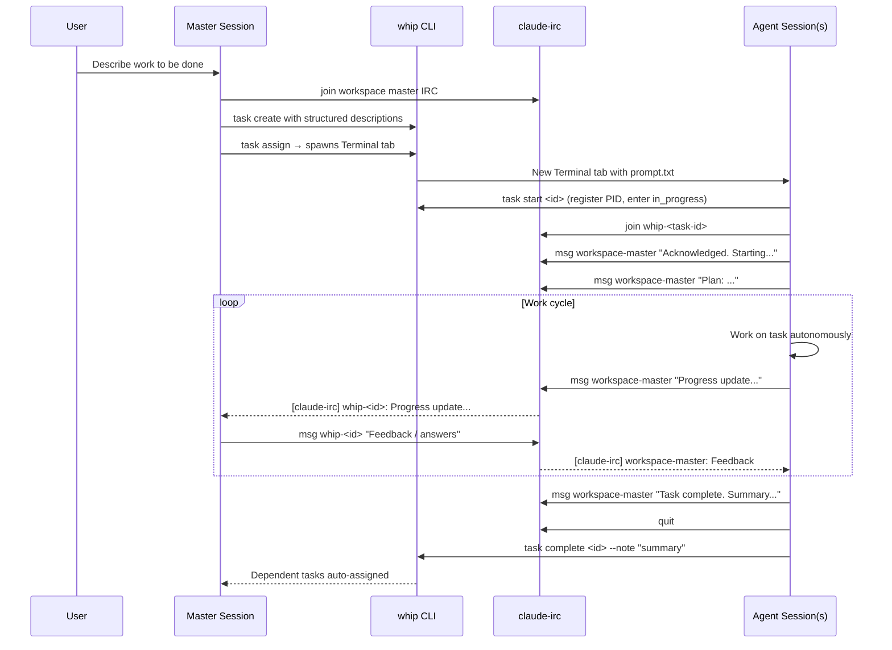
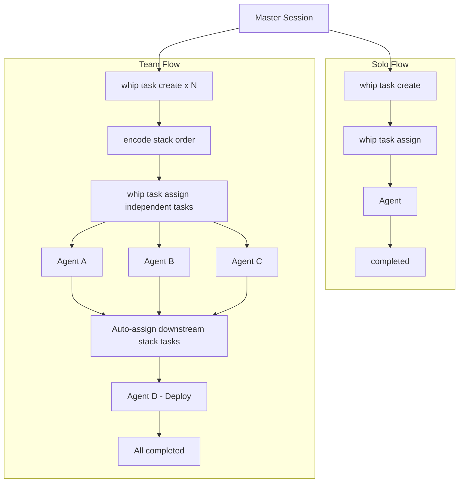
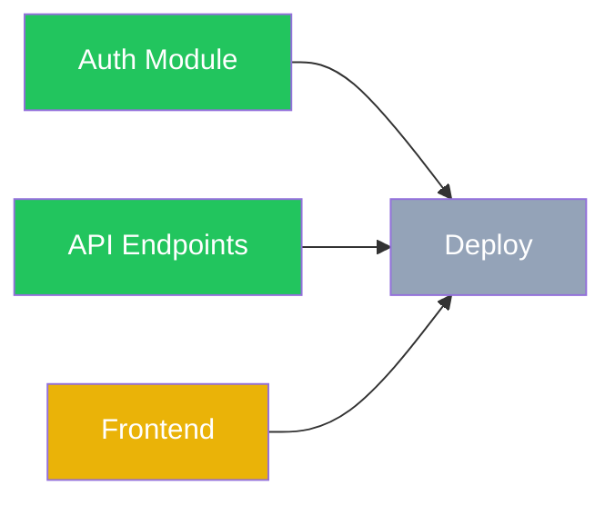

# Whip + Claude-IRC Workflow Guide

This document describes how `whip` and `claude-irc` work together to orchestrate multiple Claude Code agent sessions from a single master session.

## Overview

The workflow follows a **master-agent** pattern:

1. The **master session** (you, interacting with Claude Code) creates tasks, assigns them, and coordinates
2. Each **agent session** runs in its own Terminal tab, works autonomously on a task, and communicates back via IRC
3. `whip` manages task lifecycle (`whip task ...`) and workspace lifecycle (`whip workspace ...`)
4. `claude-irc` provides the communication layer between sessions



## Key Concepts

### Task Lifecycle

```
created --> assigned --> in_progress --> completed
                               review --> approved --> completed
                               review -- request-changes --> in_progress

assigned --> failed
in_progress --> failed
review --> failed
approved --> failed

created --> canceled
assigned --> canceled
in_progress --> canceled
review --> canceled
approved --> canceled
failed --> assigned
failed --> canceled
```

- **created**: Task stored in `global` (`WHIP_HOME/tasks/<id>/task.json`, default `~/.whip/tasks/<id>/task.json`) or a named workspace (`WHIP_HOME/workspaces/<name>/tasks/<id>/task.json`)
- **assigned**: `whip task assign` spawns a new Terminal tab with Claude Code and a prompt file. It is also the re-dispatch path from `failed`.
- **in_progress**: Agent calls `whip task start`, which registers its PID and explicitly enters active execution
- **review**: Agent finished the implementation and is waiting for master review. If the master requests changes, `whip task request-changes` returns the task to `in_progress` for rework.
- **approved**: Master approved a review task; the agent can finalize and complete it
- **failed**: Current attempt stopped, but the task is still recoverable and can be reassigned
- **completed**: Terminal success state; downstream stack tasks auto-assign
- **canceled**: Terminal stop state when the task should no longer continue
- Terminal statuses are `completed` and `canceled`
- Only lifecycle commands change task status: `assign`, `start`, `review`, `request-changes`, `approve`, `complete`, `fail`, `cancel`
- Operational commands such as `create`, `list`, `view`, `lifecycle`, `note`, `dep`, `clean`, and `delete` do not change status
- Run `whip task lifecycle` to print the canonical state machine
- Run `whip task <action> --help` to inspect the exact transition handled by that lifecycle command

### Communication Layer

`claude-irc` provides machine-wide inter-session messaging:

- **Messages**: Direct peer-to-peer text messages (`claude-irc msg`)
- **Presence**: Real-time online/offline detection via Unix sockets (`claude-irc who`)
- **Monitoring**: Periodic inbox checks via `/loop 1m claude-irc inbox`

### Global vs Workspace

- `global` is for single-task work.
- `workspace` is for stacked work.
- A named workspace should be treated as a stacked lane of related tasks.
- `whip task create --workspace <name>` is the authoritative ensure step for a named workspace.
- If the current working directory is inside git, that first create ensures `WHIP_HOME/workspaces/<name>/worktree` and resolves task `cwd` inside that worktree.
- If the current working directory is not inside git, the workspace falls back to the current `cwd` and may not have a worktree path.
- When continuing a named workspace, prefer the stored workspace worktree as the working-directory context for repo inspection, tests, and review commands.
- `claude-irc` stays shared, but master identity is scoped by workspace:
  - `global` → `wp-master`
  - `<workspace>` → `wp-master-<workspace>`

---

## Step-by-Step Workflow

### 1. Initialize the Master Session

```bash
# Single-task work in global
claude-irc join wp-master

# Stacked work in a named workspace
claude-irc join wp-master-issue-sweep

# Enable periodic message monitoring
/loop 1m claude-irc inbox
```

The master stays connected throughout the entire session. Never run `claude-irc quit` until all work is done.

### 2. Create Tasks

Each task needs a structured description with clear scope and acceptance criteria. For named workspaces, the first `whip task create --workspace <name>` also ensures the workspace metadata and, in git repos, the workspace worktree:

```bash
whip task create "Auth module" --workspace issue-sweep --desc "## Objective
Implement JWT authentication with refresh tokens.

## Scope
- In: src/auth/, src/middleware/auth.ts
- Out: Database schema changes (handled by another task)

## Acceptance Criteria
- JWT tokens issued on login
- Refresh token rotation implemented
- Auth middleware validates tokens on protected routes

## Context
- Using jsonwebtoken library already in package.json
- Token expiry: 15m access, 7d refresh"
```

The structured format (Objective / Scope / Acceptance Criteria / Context) helps agents self-orient and work independently. After a workspace has a resolved worktree, keep later repo commands pointed at that workspace path instead of the original checkout.

### 3. Encode Stack Order (if needed)

```bash
# Deploy waits on both auth and API tasks
whip task dep <deploy-id> --after <auth-id> --after <api-id>
```

Tasks with unmet prerequisites cannot be assigned. `whip task dep` is the low-level command that encodes stack order. When a prerequisite completes, `whip` automatically assigns any unblocked downstream task.

### 4. Assign Tasks

```bash
whip task assign <task-id>   # created|failed -> assigned
```

This:
- Opens a new Terminal tab
- Starts `claude --dangerously-skip-permissions` with a generated prompt file
- Uses the task's workspace to derive the correct master identity
- Uses the task's stored `cwd`, which points at the workspace worktree when one exists
- The prompt file contains: task details, IRC setup instructions, reporting protocol, and completion steps

### 5. Agent Communication

Once spawned, the agent follows a defined protocol:

```bash
# Agent initialization (automatic from prompt.txt)
whip task start <task-id>                   # assigned -> in_progress, register PID
claude-irc join whip-<task-id>              # Join IRC
claude-irc msg <workspace-master> "Acknowledged."  # Announce start
/loop 1m claude-irc inbox                   # Enable monitoring

# Agent shares plan before diving in
claude-irc msg <workspace-master> "Plan: <2-3 sentence approach>"

# Optional progress note without changing status
whip task note <task-id> "Started implementation and verified the local setup."
```

The master monitors incoming messages via the `/loop` cron and responds as needed:

```bash
# Master responds to agent questions
claude-irc msg whip-<task-id> "Use the existing UserService, don't create a new one."

# Master broadcasts to all agents
whip workspace broadcast issue-sweep "API contract updated. Check the latest notes."
```

When the whip TUI sends a message to an agent, it arrives under the identity `user`. Agents can reply directly:

```bash
# Agent replies to a TUI message
claude-irc msg user "Got it. Adjusting the approach now."
```

> **Note:** Master session CLI stream mirroring (capturing the master terminal's stdout/stderr into agent sessions) is outside the scope of this workflow.

### 6. Monitor Progress

```bash
# Quick status overview
whip task list

# Live dashboard with auto-refresh
whip dashboard

# Check specific task details
whip task view <task-id>
```

The dashboard shows task status, PID liveness, blocked-by relationships, and progress notes.

### 7. Task Completion

When an agent finishes without a review hold:

```bash
# Agent side
claude-irc msg wp-master "Task <id> complete. Implemented JWT auth with refresh tokens."
claude-irc quit
whip task complete <id> --note "JWT + refresh token auth. Files: src/auth/, src/middleware/auth.ts"
# Session auto-terminates
```

When a task completes, `whip` checks if any downstream stack tasks are now unblocked and auto-assigns them.

If the task was created with a review gate, the lifecycle is explicit:

```bash
# Agent side
whip task review <id> --note "Ready for review. Main files: src/auth/, src/middleware/auth.ts"

# Master side if rework is needed
whip task request-changes <id> --note "Address the edge cases in auth middleware before approval."

# Agent side after request-changes
whip task note <id> "Reworking auth middleware edge cases"
whip task review <id> --note "Ready for re-review. Updated auth middleware edge cases."

# Master side when approved
whip task approve <id>

# Agent side after approval
whip task complete <id> --note "Committed and finalized after review."
```

`whip task request-changes` does not spawn a new session; it returns the existing task from `review` to `in_progress` so the same agent can continue rework. Approval does not mark the task `completed`; it moves the task to `approved`, then the agent finishes with `whip task complete`.

### 8. Handling Failures

If an agent cannot complete its task:

```bash
# Agent writes detailed handoff note
claude-irc msg wp-master "Task <id> failed: <reason>. Handoff note written."
claude-irc quit
whip task fail <id> --note "Accomplished X. Failed at Y because Z. Next agent should start at..."
```

The master can then re-dispatch the same task directly:

```bash
whip task assign <id>      # failed -> assigned; handoff note stays in context
```

If the work should stop permanently, cancel it explicitly:

```bash
whip task cancel <id> --note "Scope changed; this task is no longer needed."
```

### 9. Clean Up

```bash
whip task clean                 # Remove completed/canceled tasks
whip workspace drop issue-sweep # Drop a named workspace's tasks, metadata, and worktree
claude-irc quit   # Leave IRC (only when fully done)
```

---

## Global Flow vs Workspace Flow

### Global Flow

For a single, self-contained piece of work:

```bash
# Create and assign one task
whip task create "Fix login bug" --desc "## Objective ..."
whip task assign <id>

# Monitor, respond to questions, review when done
```

- One agent, one task
- Direct communication between master and agent
- Simple lifecycle: create -> assign -> start -> complete

### Workspace Flow

For stacked work inside one named workspace:

```bash
# Step 1: Create all tasks
whip task create "Auth module" --workspace issue-sweep --desc "..."       # → id: a1b2c
whip task create "API endpoints" --workspace issue-sweep --desc "..."     # → id: d3e4f
whip task create "Frontend pages" --workspace issue-sweep --desc "..."    # → id: g5h6i
whip task create "Deploy" --workspace issue-sweep --desc "..."            # → id: j7k8l
whip workspace view issue-sweep                                            # inspect repo/worktree metadata if needed

# Step 2: Encode stack order
whip task dep j7k8l --after a1b2c --after d3e4f --after g5h6i

# Step 3: Assign root tasks inside the same workspace
whip task assign a1b2c
whip task assign d3e4f
whip task assign g5h6i

# Step 4: Coordinate — respond to messages, relay info between agents
# Step 5: Deploy auto-assigns when auth + API + frontend all complete
```

Workspace execution model:

- `git-worktree`: the first `whip task create --workspace <name>` runs in git, so whip ensures `WHIP_HOME/workspaces/<name>/worktree` and all task `cwd`s resolve inside it
- `direct-cwd`: the first `whip task create --workspace <name>` runs outside git, so tasks keep using the provided `cwd` and `worktree_path` may be empty

Key differences from Solo Flow:

| Aspect | Solo Flow | Team Flow |
|--------|-----------|-----------|
| Agents | 1 | 2+ parallel |
| Planning | Minimal | Define roles, interfaces, ownership |
| Stack order | None | Encode with `whip task dep` |
| Execution model | Direct current cwd | `git-worktree` when in git, `direct-cwd` otherwise |
| Communication | Master <-> Agent | Master <-> Agents + relay between agents |
| Coordination | Low | Master relays context, manages interfaces |



---

## Dependency-Based Auto-Assignment

One of whip's most powerful features is automatic task assignment based on stacked prerequisites.



In this example:
- Auth (completed), API (completed), Frontend (in_progress), Deploy (blocked)
- When Frontend completes, Deploy is **automatically assigned** — no manual intervention needed
- The spawned Deploy agent receives all context, including the completion notes from its stack prerequisites

This enables fire-and-forget orchestration: define the stacked order upfront, assign the root tasks, and let whip handle the rest.

---

## Real-World Example

Here's what a typical multi-task session looks like (based on actual usage):

```bash
# Master session starts
claude-irc join wp-master
/loop 1m claude-irc inbox

# User asks: "Refactor the auth system and write docs for the workflow"

# Master creates tasks
whip task create "Refactor auth module" --desc "## Objective
Refactor auth to use middleware pattern...
## Scope
- In: src/auth/
- Out: API endpoints (separate task)
## Acceptance Criteria
- Auth middleware extracts and validates JWT
- Refresh token rotation works
## Context
- Current auth is inline in route handlers"
# → Created task a1b2c

whip task create "Workflow documentation" --desc "## Objective
Write docs/workflow.md covering whip + claude-irc workflow...
## Scope
- In: New file docs/workflow.md
- Out: No code changes
## Acceptance Criteria
- Markdown document with Mermaid diagrams
- Covers solo and team flows
## Context
- Reference README.md, SKILL.md, CLAUDE.md for content"
# → Created task 3aae4

# Assign both tasks (no stack prerequisite between them)
whip task assign a1b2c --master-irc wp-master
whip task assign 3aae4 --master-irc wp-master

# Agents initialize and share plans
# [claude-irc] wp-a1b2c: Acknowledged. Plan: Extract auth logic into middleware...
# [claude-irc] whip-3aae4: Acknowledged. Plan: Write workflow doc with Mermaid diagrams...

# Master monitors via dashboard
whip dashboard

# Agent asks a question
# [claude-irc] wp-a1b2c: Should I keep backward compat with the old auth helpers?
claude-irc msg wp-a1b2c "No, clean break. Remove the old helpers entirely."

# Agents complete
# [claude-irc] wp-a1b2c: Task complete. Extracted auth middleware, removed old helpers.
# [claude-irc] whip-3aae4: Task complete. docs/workflow.md created with diagrams.

# Clean up
whip task clean
```

---

## Command Reference

### whip task lifecycle commands

| Command | Description |
|---------|-------------|
| `whip task assign <id> [--master-irc <name>]` | `created|failed -> assigned`; spawn an agent session |
| `whip task start <id>` | `assigned -> in_progress`; register PID for the current run |
| `whip task review <id>` | `in_progress -> review` |
| `whip task request-changes <id>` | `review -> in_progress` |
| `whip task approve <id>` | `review -> approved` |
| `whip task complete <id>` | `in_progress|approved -> completed` |
| `whip task fail <id>` | `assigned|in_progress|review|approved -> failed` |
| `whip task cancel <id>` | `created|assigned|in_progress|review|approved|failed -> canceled` |

### whip task operational commands

| Command | Description |
|---------|-------------|
| `whip task create <title> [--desc/--file/stdin] [--workspace <name>]` | Create a new task |
| `whip task list` | List all tasks with status |
| `whip task view <id>` | View task details |
| `whip task lifecycle [id] [--format json]` | Show the full state machine or valid next actions |
| `whip task note <id> "<message>"` | Add progress information without changing status |
| `whip task dep <id> --after <id>` | Encode stack prerequisites |
| `whip task clean` | Remove completed/canceled tasks |
| `whip task delete <id>` | Delete a task |

Legacy task commands from the old generic status flow have been removed.

### whip workspace commands

| Command | Description |
|---------|-------------|
| `whip workspace list` | List named workspaces |
| `whip workspace view <name>` | View workspace metadata and tasks |
| `whip workspace broadcast <workspace> <message>` | Message all active sessions in that workspace |
| `whip workspace drop <name>` | Remove workspace tasks, metadata, and worktree |

### other whip commands

| Command | Description |
|---------|-------------|
| `whip dashboard` | Live TUI dashboard |
| `whip remote` | Start remote mode with web dashboard |

### claude-irc commands

| Command | Description |
|---------|-------------|
| `claude-irc join <name>` | Join the channel |
| `claude-irc who` | List peers (online/offline) |
| `claude-irc msg <peer> "text"` | Send a message |
| `claude-irc inbox` | Show unread messages |
| `claude-irc inbox <n>` | Read full message by index |
| `claude-irc inbox --all` | Show all messages |
| `claude-irc inbox clear` | Delete all messages |
| `claude-irc broadcast "msg"` | Message all peers |
| `claude-irc quit` | Leave and clean up |
