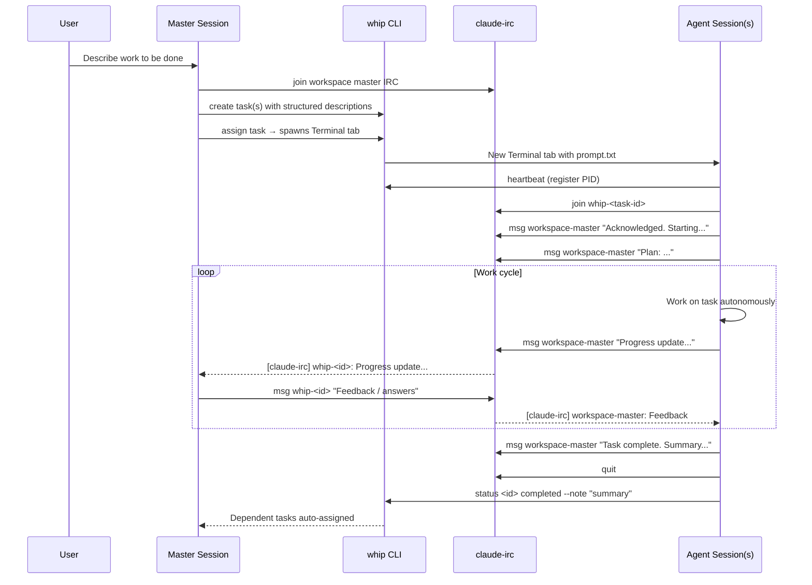
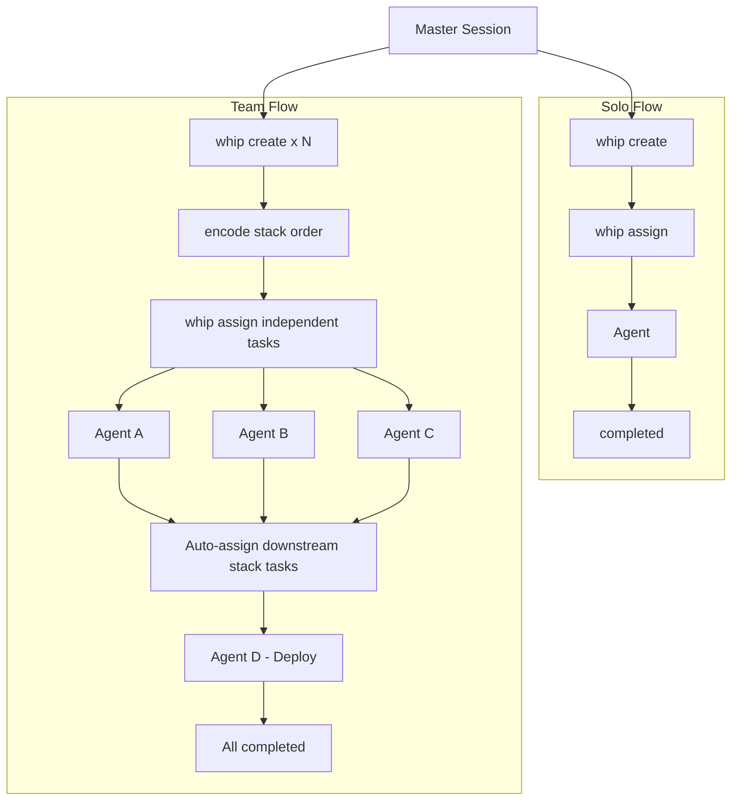
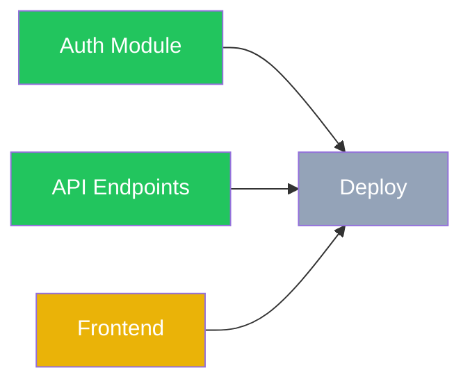

# Whip + Claude-IRC Workflow Guide

This document describes how `whip` and `claude-irc` work together to orchestrate multiple Claude Code agent sessions from a single master session.

## Overview

The workflow follows a **master-agent** pattern:

1. The **master session** (you, interacting with Claude Code) creates tasks, assigns them, and coordinates
2. Each **agent session** runs in its own Terminal tab, works autonomously on a task, and communicates back via IRC
3. `whip` manages task lifecycle (create, assign, monitor, complete)
4. `claude-irc` provides the communication layer between sessions



## Key Concepts

### Task Lifecycle

```
created --> assigned --> in_progress --> completed
                                    --> failed
```

- **created**: Task stored in `global` (`~/.whip/tasks/<id>/task.json`) or a named workspace (`~/.whip/workspaces/<name>/tasks/<id>/task.json`)
- **assigned**: `whip assign` spawns a new Terminal tab with Claude Code and a prompt file
- **in_progress**: Agent calls `whip heartbeat`, registering its PID
- **completed**: Agent finishes work; downstream stack tasks auto-assign
- **failed**: Agent couldn't complete; handoff note preserved for retry

### Communication Layer

`claude-irc` provides machine-wide inter-session messaging:

- **Messages**: Direct peer-to-peer text messages (`claude-irc msg`)
- **Presence**: Real-time online/offline detection via Unix sockets (`claude-irc who`)
- **Monitoring**: Periodic inbox checks via `/loop 1m claude-irc inbox`

### Global vs Workspace

- `global` is for single-task work.
- `workspace` is for stacked work.
- A named workspace should be treated as a stacked lane of related tasks.
- `claude-irc` stays shared, but master identity is scoped by workspace:
  - `global` → `whip-master`
  - `<workspace>` → `whip-master-<workspace>`

---

## Step-by-Step Workflow

### 1. Initialize the Master Session

```bash
# Single-task work in global
claude-irc join whip-master

# Stacked work in a named workspace
claude-irc join whip-master-issue-sweep

# Enable periodic message monitoring
/loop 1m claude-irc inbox
```

The master stays connected throughout the entire session. Never run `claude-irc quit` until all work is done.

### 2. Create Tasks

Each task needs a structured description with clear scope and acceptance criteria:

```bash
whip create "Auth module" --workspace issue-sweep --desc "## Objective
Implement JWT authentication with refresh tokens.

## Scope
- In: src/auth/, src/middleware/auth.ts
- Out: Database schema changes (handled by another task)

## Acceptance Criteria
- JWT tokens issued on login
- Refresh token rotation implemented
- Auth middleware validates tokens on protected routes

## Context
- Using jsonwebtoken library already in package.json
- Token expiry: 15m access, 7d refresh"
```

The structured format (Objective / Scope / Acceptance Criteria / Context) helps agents self-orient and work independently.

### 3. Encode Stack Order (if needed)

```bash
# Deploy waits on both auth and API tasks
whip dep <deploy-id> --after <auth-id> --after <api-id>
```

Tasks with unmet prerequisites cannot be assigned. `whip dep` is the low-level command that encodes stack order. When a prerequisite completes, `whip` automatically assigns any unblocked downstream task.

### 4. Assign Tasks

```bash
whip assign <task-id>
```

This:
- Opens a new Terminal tab
- Starts `claude --dangerously-skip-permissions` with a generated prompt file
- Uses the task's workspace to derive the correct master identity
- The prompt file contains: task details, IRC setup instructions, reporting protocol, and completion steps

### 5. Agent Communication

Once spawned, the agent follows a defined protocol:

```bash
# Agent initialization (automatic from prompt.txt)
whip heartbeat <task-id>                    # Register PID
claude-irc join whip-<task-id>              # Join IRC
claude-irc msg <workspace-master> "Acknowledged."  # Announce start
/loop 1m claude-irc inbox                   # Enable monitoring

# Agent shares plan before diving in
claude-irc msg <workspace-master> "Plan: <2-3 sentence approach>"
```

The master monitors incoming messages via the `/loop` cron and responds as needed:

```bash
# Master responds to agent questions
claude-irc msg whip-<task-id> "Use the existing UserService, don't create a new one."

# Master broadcasts to all agents
whip broadcast "API contract updated. Check the latest notes."
```

When the whip TUI sends a message to an agent, it arrives under the identity `user`. Agents can reply directly:

```bash
# Agent replies to a TUI message
claude-irc msg user "Got it. Adjusting the approach now."
```

> **Note:** Master session CLI stream mirroring (capturing the master terminal's stdout/stderr into agent sessions) is outside the scope of this workflow.

### 6. Monitor Progress

```bash
# Quick status overview
whip list

# Live dashboard with auto-refresh
whip dashboard

# Check specific task details
whip show <task-id>
```

The dashboard shows task status, PID liveness, blocked-by relationships, and progress notes.

### 7. Task Completion

When an agent finishes:

```bash
# Agent side
claude-irc msg whip-master "Task <id> complete. Implemented JWT auth with refresh tokens."
claude-irc quit
whip status <id> completed --note "JWT + refresh token auth. Files: src/auth/, src/middleware/auth.ts"
# Session auto-terminates
```

When a task completes, `whip` checks if any downstream stack tasks are now unblocked and auto-assigns them.

### 8. Handling Failures

If an agent cannot complete its task:

```bash
# Agent writes detailed handoff note
claude-irc msg whip-master "Task <id> failed: <reason>. Handoff note written."
claude-irc quit
whip status <id> failed --note "Accomplished X. Failed at Y because Z. Next agent should start at..."
```

The master can then retry:

```bash
whip unassign <id>    # Reset to created
whip assign <id>      # Spawn fresh agent (handoff note included in prompt)
```

### 9. Clean Up

```bash
whip clean        # Remove completed/failed tasks
claude-irc quit   # Leave IRC (only when fully done)
```

---

## Global Flow vs Workspace Flow

### Global Flow

For a single, self-contained piece of work:

```bash
# Create and assign one task
whip create "Fix login bug" --desc "## Objective ..."
whip assign <id>

# Monitor, respond to questions, review when done
```

- One agent, one task
- Direct communication between master and agent
- Simple lifecycle: create -> assign -> monitor -> complete

### Workspace Flow

For stacked work inside one named workspace:

```bash
# Step 1: Create all tasks
whip create "Auth module" --workspace issue-sweep --desc "..."       # → id: a1b2c
whip create "API endpoints" --workspace issue-sweep --desc "..."     # → id: d3e4f
whip create "Frontend pages" --workspace issue-sweep --desc "..."    # → id: g5h6i
whip create "Deploy" --workspace issue-sweep --desc "..."            # → id: j7k8l

# Step 2: Encode stack order
whip dep j7k8l --after a1b2c --after d3e4f --after g5h6i

# Step 3: Assign root tasks inside the same workspace
whip assign a1b2c
whip assign d3e4f
whip assign g5h6i

# Step 4: Coordinate — respond to messages, relay info between agents
# Step 5: Deploy auto-assigns when auth + API + frontend all complete
```

Key differences from Solo Flow:

| Aspect | Solo Flow | Team Flow |
|--------|-----------|-----------|
| Agents | 1 | 2+ parallel |
| Planning | Minimal | Define roles, interfaces, ownership |
| Stack order | None | Encode with `whip dep` |
| Communication | Master <-> Agent | Master <-> Agents + relay between agents |
| Coordination | Low | Master relays context, manages interfaces |



---

## Dependency-Based Auto-Assignment

One of whip's most powerful features is automatic task assignment based on stacked prerequisites.



In this example:
- Auth (completed), API (completed), Frontend (in_progress), Deploy (blocked)
- When Frontend completes, Deploy is **automatically assigned** — no manual intervention needed
- The spawned Deploy agent receives all context, including the completion notes from its stack prerequisites

This enables fire-and-forget orchestration: define the stacked order upfront, assign the root tasks, and let whip handle the rest.

---

## Real-World Example

Here's what a typical multi-task session looks like (based on actual usage):

```bash
# Master session starts
claude-irc join whip-master
/loop 1m claude-irc inbox

# User asks: "Refactor the auth system and write docs for the workflow"

# Master creates tasks
whip create "Refactor auth module" --desc "## Objective
Refactor auth to use middleware pattern...
## Scope
- In: src/auth/
- Out: API endpoints (separate task)
## Acceptance Criteria
- Auth middleware extracts and validates JWT
- Refresh token rotation works
## Context
- Current auth is inline in route handlers"
# → Created task a1b2c

whip create "Workflow documentation" --desc "## Objective
Write docs/workflow.md covering whip + claude-irc workflow...
## Scope
- In: New file docs/workflow.md
- Out: No code changes
## Acceptance Criteria
- Markdown document with Mermaid diagrams
- Covers solo and team flows
## Context
- Reference README.md, SKILL.md, CLAUDE.md for content"
# → Created task 3aae4

# Assign both tasks (no stack prerequisite between them)
whip assign a1b2c --master-irc whip-master
whip assign 3aae4 --master-irc whip-master

# Agents initialize and share plans
# [claude-irc] whip-a1b2c: Acknowledged. Plan: Extract auth logic into middleware...
# [claude-irc] whip-3aae4: Acknowledged. Plan: Write workflow doc with Mermaid diagrams...

# Master monitors via dashboard
whip dashboard

# Agent asks a question
# [claude-irc] whip-a1b2c: Should I keep backward compat with the old auth helpers?
claude-irc msg whip-a1b2c "No, clean break. Remove the old helpers entirely."

# Agents complete
# [claude-irc] whip-a1b2c: Task complete. Extracted auth middleware, removed old helpers.
# [claude-irc] whip-3aae4: Task complete. docs/workflow.md created with diagrams.

# Clean up
whip clean
```

---

## Command Reference

### whip commands

| Command | Description |
|---------|-------------|
| `whip create <title> [--desc/--file/stdin]` | Create a new task |
| `whip list` | List all tasks with status |
| `whip show <id>` | Show task details |
| `whip assign <id> [--master-irc <name>]` | Spawn agent in new Terminal tab |
| `whip unassign <id>` | Kill session, reset to created |
| `whip status <id> [status] [--note]` | Get/set status with notes |
| `whip broadcast "message"` | Message all active sessions |
| `whip heartbeat [id]` | Register PID (called by agents) |
| `whip kill <id>` | Force kill a session |
| `whip clean` | Remove completed/failed tasks |
| `whip dashboard` | Live TUI dashboard |
| `whip dep <id> --after <id>` | Encode stack prerequisites |

### claude-irc commands

| Command | Description |
|---------|-------------|
| `claude-irc join <name>` | Join the channel |
| `claude-irc who` | List peers (online/offline) |
| `claude-irc msg <peer> "text"` | Send a message |
| `claude-irc inbox` | Show unread messages |
| `claude-irc inbox <n>` | Read full message by index |
| `claude-irc inbox --all` | Show all messages |
| `claude-irc inbox clear` | Delete all messages |
| `claude-irc broadcast "msg"` | Message all peers |
| `claude-irc quit` | Leave and clean up |
