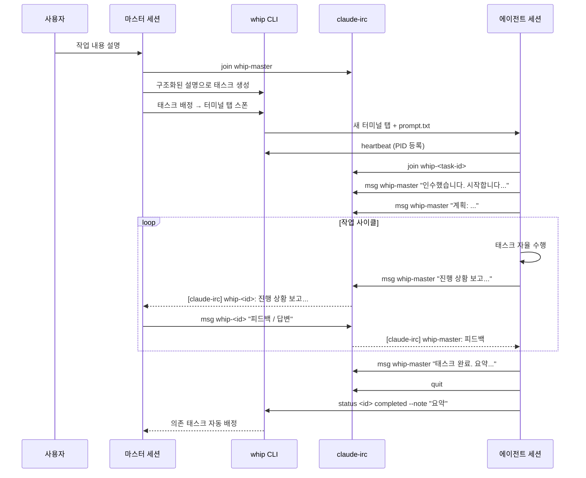
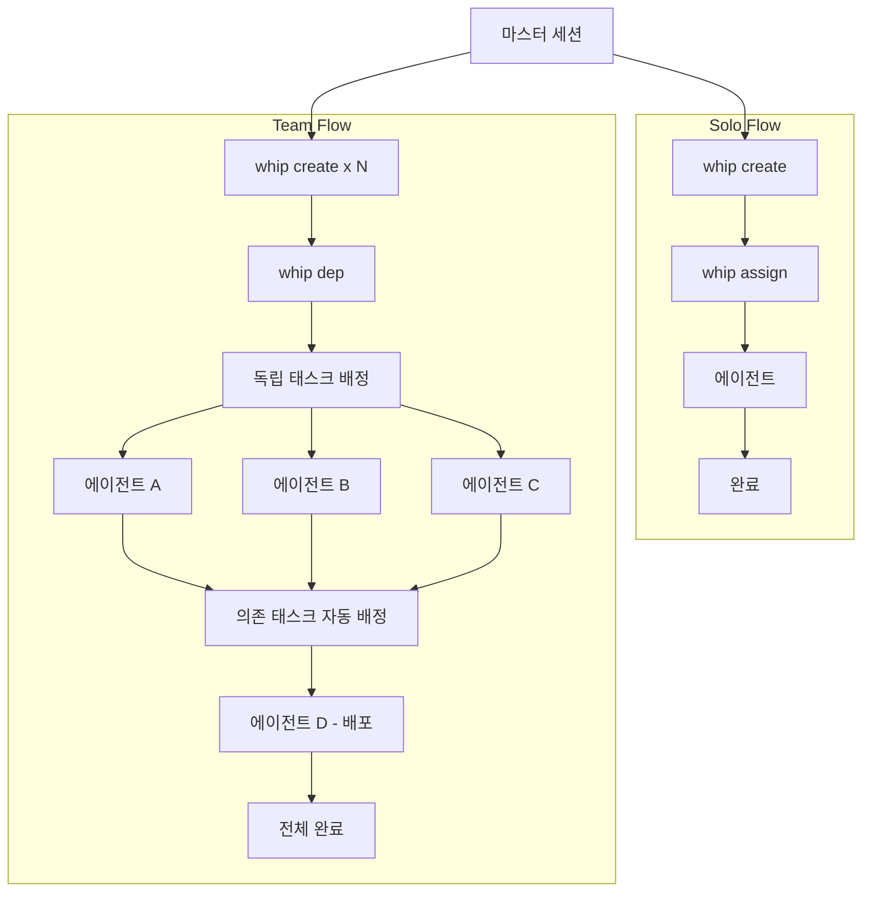
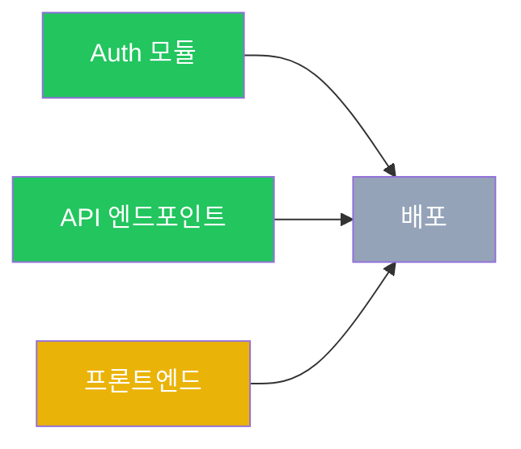

# Whip + Claude-IRC 워크플로우 가이드

`whip`과 `claude-irc`를 함께 사용하여 하나의 마스터 세션에서 여러 Claude Code 에이전트 세션을 오케스트레이션하는 방법을 설명합니다.

## 개요

워크플로우는 **마스터-에이전트** 패턴을 따릅니다:

1. **마스터 세션** (사용자가 Claude Code와 대화하는 세션)이 태스크를 생성, 배정, 조율
2. 각 **에이전트 세션**은 별도의 터미널 탭에서 실행되며, 태스크를 자율적으로 수행하고 IRC로 마스터와 통신
3. `whip`이 태스크 라이프사이클을 관리 (생성, 배정, 모니터링, 완료)
4. `claude-irc`가 세션 간 통신 레이어를 제공



## 핵심 개념

### 태스크 라이프사이클

```
created --> assigned --> in_progress --> completed
                                    --> failed
```

- **created**: `~/.whip/tasks/<id>/task.json`에 태스크 저장
- **assigned**: `whip assign`이 새 터미널 탭에 Claude Code와 프롬프트 파일을 스폰
- **in_progress**: 에이전트가 `whip heartbeat`를 호출하여 PID 등록
- **completed**: 에이전트 작업 완료; 의존 태스크 자동 배정
- **failed**: 에이전트가 완료하지 못함; 인수인계 노트가 retry를 위해 보존

### 통신 레이어

`claude-irc`는 머신 내 세션 간 메시징을 제공합니다:

- **메시지**: 피어 간 직접 텍스트 메시지 (`claude-irc msg`)
- **토픽**: API 계약 등 영속적인 구조화된 컨텍스트 (`claude-irc topic`)
- **프레즌스**: Unix 소켓 기반 온라인/오프라인 감지 (`claude-irc who`)
- **모니터링**: `/loop 1m claude-irc inbox`로 주기적 메시지 확인

---

## 단계별 워크플로우

### 1. 마스터 세션 초기화

```bash
# IRC에 마스터로 참여
claude-irc join whip-master

# 주기적 메시지 모니터링 활성화
/loop 1m claude-irc inbox
```

마스터는 전체 세션 동안 연결을 유지합니다. 모든 작업이 끝날 때까지 `claude-irc quit`을 실행하지 마세요.

### 2. 태스크 생성

각 태스크에는 명확한 스코프와 수락 기준이 포함된 구조화된 설명이 필요합니다:

```bash
whip create "Auth 모듈" --desc "## Objective
리프레시 토큰을 포함한 JWT 인증 구현.

## Scope
- In: src/auth/, src/middleware/auth.ts
- Out: 데이터베이스 스키마 변경 (다른 태스크에서 처리)

## Acceptance Criteria
- 로그인 시 JWT 토큰 발급
- 리프레시 토큰 로테이션 구현
- 인증 미들웨어가 보호된 라우트에서 토큰 검증

## Context
- package.json에 이미 있는 jsonwebtoken 라이브러리 사용
- 토큰 만료: 액세스 15분, 리프레시 7일"
```

구조화된 포맷 (Objective / Scope / Acceptance Criteria / Context)은 에이전트가 스스로 방향을 잡고 독립적으로 작업하는 데 도움을 줍니다.

### 3. 의존성 설정 (필요시)

```bash
# Deploy 태스크가 auth와 API 태스크에 의존
whip dep <deploy-id> --after <auth-id> --after <api-id>
```

충족되지 않은 의존성이 있는 태스크는 배정할 수 없습니다. 의존성이 완료되면 `whip`이 차단 해제된 태스크를 자동으로 배정합니다.

### 4. 태스크 배정

```bash
whip assign <task-id> --master-irc whip-master
```

이 명령은:
- 새 터미널 탭을 열고
- 생성된 프롬프트 파일과 함께 `claude --dangerously-skip-permissions`를 시작
- 프롬프트 파일에는 태스크 상세, IRC 설정 지침, 보고 프로토콜, 완료 단계가 포함

### 5. 에이전트 커뮤니케이션

스폰된 에이전트는 정해진 프로토콜을 따릅니다:

```bash
# 에이전트 초기화 (prompt.txt에서 자동 실행)
whip heartbeat <task-id>                    # PID 등록
claude-irc join whip-<task-id>              # IRC 참여
claude-irc msg whip-master "인수했습니다."    # 시작 알림
/loop 1m claude-irc inbox                   # 모니터링 활성화

# 에이전트가 작업 전 계획을 공유
claude-irc msg whip-master "계획: <2-3문장 접근 방식>"
```

마스터는 `/loop` 크론을 통해 수신 메시지를 모니터링하고 필요에 따라 응답합니다:

```bash
# 마스터가 에이전트 질문에 응답
claude-irc msg whip-<task-id> "기존 UserService를 사용해. 새로 만들지 마."

# 마스터가 전체 에이전트에 브로드캐스트
whip broadcast "API 계약이 업데이트되었습니다. 토픽 보드를 확인하세요."
```

### 6. 진행 모니터링

```bash
# 빠른 상태 확인
whip list

# 자동 새로고침되는 라이브 대시보드
whip dashboard

# 특정 태스크 상세 확인
whip show <task-id>
```

대시보드는 태스크 상태, PID 활성 여부, 의존성 그래프, 진행 노트를 보여줍니다.

### 7. 태스크 완료

에이전트가 작업을 마치면:

```bash
# 에이전트 측
claude-irc msg whip-master "태스크 <id> 완료. JWT 인증과 리프레시 토큰 구현 완료."
claude-irc quit
whip status <id> completed --note "JWT + 리프레시 토큰 인증. 파일: src/auth/, src/middleware/auth.ts"
# 세션 자동 종료
```

태스크가 완료되면 `whip`이 차단 해제된 의존 태스크가 있는지 확인하고 자동으로 배정합니다.

### 8. 실패 처리

에이전트가 태스크를 완료하지 못한 경우:

```bash
# 에이전트가 상세한 인수인계 노트 작성
claude-irc msg whip-master "태스크 <id> 실패: <이유>. 인수인계 노트 작성 완료."
claude-irc quit
whip status <id> failed --note "X를 완료함. Y에서 Z 때문에 실패. 다음 에이전트는 ...부터 시작해야 함"
```

마스터가 재시도할 수 있습니다:

```bash
whip unassign <id>    # created로 리셋
whip assign <id>      # 새 에이전트 스폰 (인수인계 노트가 프롬프트에 포함)
```

### 9. 정리

```bash
whip clean        # 완료/실패 태스크 제거
claude-irc quit   # IRC 퇴장 (모든 작업이 완전히 끝났을 때만)
```

---

## Solo Flow vs Team Flow

### Solo Flow

하나의 독립적인 작업을 처리할 때:

```bash
# 태스크 하나 생성하고 배정
whip create "로그인 버그 수정" --desc "## Objective ..."
whip assign <id> --master-irc whip-master

# 모니터링, 질문에 답변, 완료 시 리뷰
```

- 에이전트 1개, 태스크 1개
- 마스터와 에이전트 간 직접 통신
- 단순한 라이프사이클: 생성 -> 배정 -> 모니터링 -> 완료

### Team Flow

2개 이상의 독립적인 병렬 태스크로 분해 가능한 작업:

```bash
# Step 1: 모든 태스크 생성
whip create "Auth 모듈" --desc "..."           # → id: a1b2c
whip create "API 엔드포인트" --desc "..."       # → id: d3e4f
whip create "프론트엔드 페이지" --desc "..."     # → id: g5h6i
whip create "배포" --desc "..."                 # → id: j7k8l

# Step 2: 의존성 설정
whip dep j7k8l --after a1b2c --after d3e4f --after g5h6i

# Step 3: 독립 태스크 배정 (배포는 대기)
whip assign a1b2c --master-irc whip-master
whip assign d3e4f --master-irc whip-master
whip assign g5h6i --master-irc whip-master

# Step 4: 조율 — 메시지에 응답, 에이전트 간 정보 전달
# Step 5: Auth + API + 프론트엔드가 모두 완료되면 배포가 자동 배정
```

Solo Flow와의 주요 차이점:

| 항목 | Solo Flow | Team Flow |
|------|-----------|-----------|
| 에이전트 | 1개 | 2개 이상 병렬 |
| 계획 | 최소 | 역할, 인터페이스, 소유권 정의 |
| 의존성 | 없음 | `whip dep`으로 설정 |
| 통신 | 마스터 <-> 에이전트 | 마스터 <-> 에이전트들 + 에이전트 간 중계 |
| 조율 | 낮음 | 마스터가 컨텍스트 전달, 인터페이스 관리 |



---

## 의존성 기반 자동 배정

whip의 가장 강력한 기능 중 하나는 의존성 기반 자동 태스크 배정입니다.



이 예시에서:
- Auth (완료), API (완료), 프론트엔드 (진행 중), 배포 (차단됨)
- 프론트엔드가 완료되면 배포가 **자동으로 배정** — 수동 개입 불필요
- 스폰된 배포 에이전트는 의존 태스크들의 완료 노트를 포함한 모든 컨텍스트를 받음

이를 통해 fire-and-forget 오케스트레이션이 가능합니다: 의존성 그래프를 미리 정의하고, 루트 태스크를 배정하면, whip이 나머지를 처리합니다.

---

## 실제 사용 예시

실제 멀티태스크 세션의 흐름 (실사용 기반):

```bash
# 마스터 세션 시작
claude-irc join whip-master
/loop 1m claude-irc inbox

# 사용자 요청: "인증 시스템 리팩터링하고 워크플로우 문서 작성해줘"

# 마스터가 태스크 생성
whip create "Auth 모듈 리팩터링" --desc "## Objective
미들웨어 패턴으로 인증 리팩터링...
## Scope
- In: src/auth/
- Out: API 엔드포인트 (별도 태스크)
## Acceptance Criteria
- 인증 미들웨어가 JWT를 추출하고 검증
- 리프레시 토큰 로테이션 동작
## Context
- 현재 인증은 라우트 핸들러에 인라인으로 구현"
# → Created task a1b2c

whip create "워크플로우 문서" --desc "## Objective
whip + claude-irc 워크플로우를 다루는 docs/workflow.md 작성...
## Scope
- In: 새 파일 docs/workflow.md
- Out: 코드 변경 없음
## Acceptance Criteria
- Mermaid 다이어그램이 포함된 마크다운 문서
- Solo와 Team flow를 모두 다룸
## Context
- README.md, SKILL.md, CLAUDE.md를 참조하여 내용 작성"
# → Created task 3aae4

# 두 태스크 모두 배정 (의존성 없음)
whip assign a1b2c --master-irc whip-master
whip assign 3aae4 --master-irc whip-master

# 에이전트들이 초기화하고 계획 공유
# [claude-irc] whip-a1b2c: 인수했습니다. 계획: 인증 로직을 미들웨어로 추출...
# [claude-irc] whip-3aae4: 인수했습니다. 계획: Mermaid 다이어그램 포함 워크플로우 문서 작성...

# 마스터가 대시보드로 모니터링
whip dashboard

# 에이전트가 질문
# [claude-irc] whip-a1b2c: 기존 인증 헬퍼와의 하위 호환성을 유지해야 할까요?
claude-irc msg whip-a1b2c "아니, 완전히 새로 만들어. 기존 헬퍼는 전부 제거해."

# 에이전트들 완료
# [claude-irc] whip-a1b2c: 태스크 완료. 인증 미들웨어 추출, 기존 헬퍼 제거 완료.
# [claude-irc] whip-3aae4: 태스크 완료. docs/workflow.md 다이어그램 포함하여 생성 완료.

# 정리
whip clean
```

---

## 커맨드 레퍼런스

### whip 커맨드

| 커맨드 | 설명 |
|--------|------|
| `whip create <title> [--desc/--file/stdin]` | 새 태스크 생성 |
| `whip list` | 모든 태스크 상태 확인 |
| `whip show <id>` | 태스크 상세 보기 |
| `whip assign <id> [--master-irc <name>]` | 새 터미널 탭에 에이전트 스폰 |
| `whip unassign <id>` | 세션 종료, created로 리셋 |
| `whip status <id> [status] [--note]` | 상태 조회/설정 (노트 포함) |
| `whip broadcast "message"` | 모든 활성 세션에 메시지 전송 |
| `whip heartbeat [id]` | PID 등록 (에이전트가 호출) |
| `whip kill <id>` | 세션 강제 종료 |
| `whip clean` | 완료/실패 태스크 제거 |
| `whip dashboard` | 라이브 TUI 대시보드 |
| `whip dep <id> --after <id>` | 태스크 의존성 설정 |

### claude-irc 커맨드

| 커맨드 | 설명 |
|--------|------|
| `claude-irc join <name>` | 채널 참여 |
| `claude-irc who` | 피어 목록 (온라인/오프라인) |
| `claude-irc msg <peer> "text"` | 메시지 전송 |
| `claude-irc inbox` | 읽지 않은 메시지 보기 |
| `claude-irc inbox <n>` | 인덱스로 전체 메시지 읽기 |
| `claude-irc inbox --all` | 읽은 메시지 포함 전체 보기 |
| `claude-irc inbox clear` | 모든 메시지 삭제 |
| `claude-irc check [--quiet]` | 새 메시지 확인 (hook 친화적) |
| `claude-irc topic "title"` | 구조화된 컨텍스트 게시 (stdin) |
| `claude-irc board <peer> [n]` | 피어의 토픽 읽기 |
| `claude-irc broadcast "msg"` | 모든 피어에 메시지 전송 |
| `claude-irc quit` | 퇴장 및 정리 |
