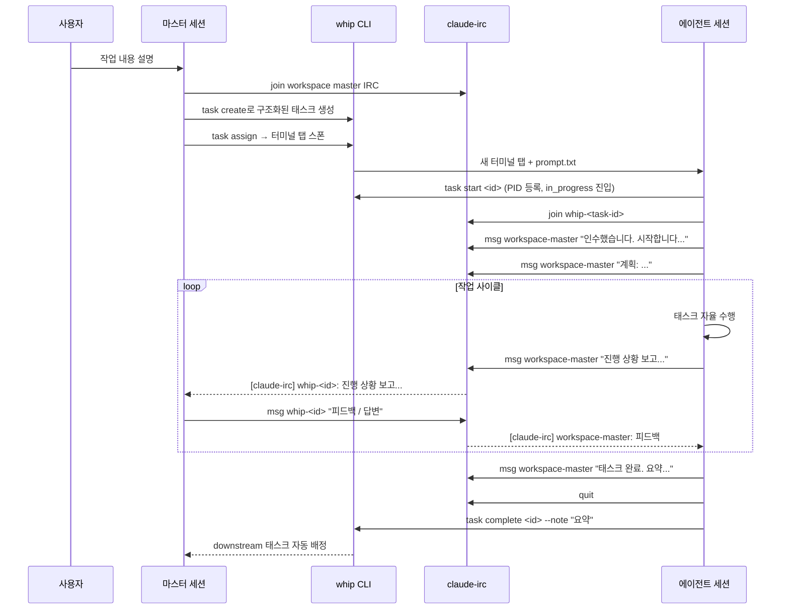
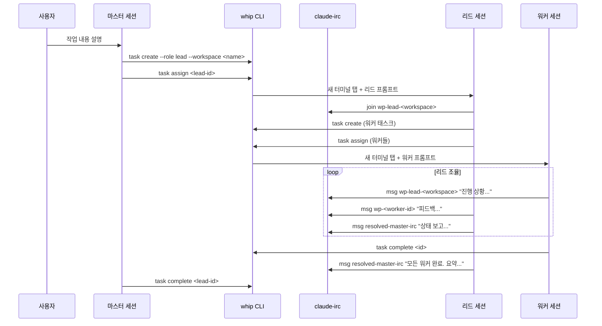
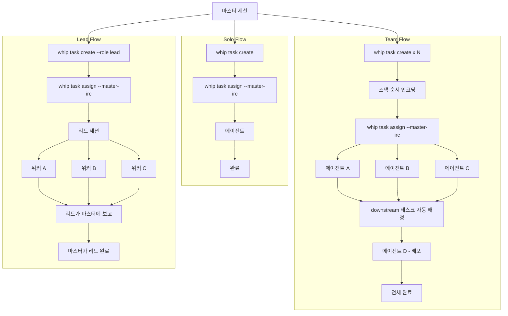
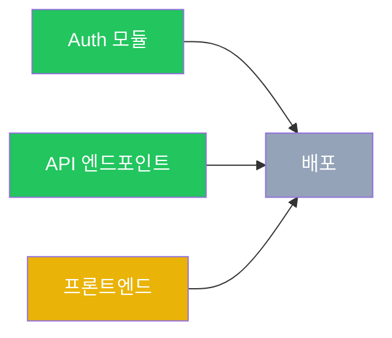

# Whip + Claude-IRC 워크플로우 가이드

`whip`과 `claude-irc`를 함께 사용하여 하나의 마스터 세션에서 여러 Claude Code 에이전트 세션을 오케스트레이션하는 방법을 설명합니다.

## 개요

워크플로우는 **마스터-에이전트** 패턴을 따르며 두 가지 오케스트레이션 계층을 지원합니다:

1. **2-tier (마스터 → 워커)**: 마스터 세션이 태스크를 생성하고 워커를 직접 관리 및 조율
2. **3-tier (마스터 → 리드 → 워커)**: 마스터가 Workspace Lead를 생성하면, 리드가 자율적으로 워커를 스폰하고 IRC로 조율하며 진행 상황을 보고
3. 각 **에이전트 세션**은 별도의 터미널 탭에서 실행되며, 태스크를 자율적으로 수행하고 IRC로 통신
4. `whip`이 태스크 라이프사이클(`whip task ...`)과 workspace 라이프사이클(`whip workspace ...`)을 관리
5. `claude-irc`가 세션 간 통신 레이어를 제공



3-tier 모델에서는 리드가 중간 오케스트레이터 역할을 합니다:



## 핵심 개념

### 태스크 라이프사이클

```
created --> assigned --> in_progress --> completed
                               review --> approved --> completed
                               review -- request-changes --> in_progress

assigned --> failed
in_progress --> failed
review --> failed
approved --> failed

created --> canceled
assigned --> canceled
in_progress --> canceled
review --> canceled
approved --> canceled
failed --> assigned
failed --> canceled
```

- **created**: `global` (`WHIP_HOME/tasks/<id>/task.json`, 기본값 `~/.whip/tasks/<id>/task.json`) 또는 named workspace (`WHIP_HOME/workspaces/<name>/tasks/<id>/task.json`)에 태스크 저장
- **assigned**: `whip task assign`이 새 터미널 탭에 Claude Code와 프롬프트 파일을 스폰합니다. `failed`에서 다시 배정할 때도 같은 명령을 사용합니다.
- **in_progress**: 에이전트가 `whip task start`를 호출하여 PID를 등록하고 실제 작업을 시작합니다.
- **review**: 에이전트 구현이 끝났고 마스터 리뷰를 기다리는 상태입니다. 마스터가 `whip task request-changes`를 실행하면 태스크는 `in_progress`로 돌아가 재작업을 이어갑니다.
- **approved**: 마스터가 리뷰를 승인했고, 에이전트가 마무리 커밋과 완료 처리를 할 수 있는 상태입니다.
- **failed**: 현재 시도는 중단되었지만 태스크 자체는 살아 있으며, 인수인계 노트를 유지한 채 다시 `assign`할 수 있습니다.
- **completed**: 최종 성공 종료 상태입니다. downstream stack 태스크는 자동 배정될 수 있습니다.
- **canceled**: 더 이상 진행하지 않기로 한 최종 중단 상태입니다.
- terminal status는 `completed`, `canceled`입니다.
- status를 바꾸는 명령은 lifecycle command뿐입니다: `assign`, `start`, `review`, `request-changes`, `approve`, `complete`, `fail`, `cancel`
- `create`, `list`, `view`, `lifecycle`, `note`, `dep`, `archive`, `clean`, `delete`는 operation command이며 status를 바꾸지 않습니다.
- 전체 상태 머신은 `whip task lifecycle`로 확인합니다.
- 각 lifecycle command의 정확한 전이와 부수효과는 `whip task <action> --help`로 확인합니다.

### 통신 레이어

`claude-irc`는 머신 내 세션 간 메시징을 제공합니다:

- **메시지**: 피어 간 직접 텍스트 메시지 (`claude-irc msg`)
- **프레즌스**: Unix 소켓 기반 온라인/오프라인 감지 (`claude-irc who`)
- **Identity**: 세션 마커 기반 현재 세션 identity 조회 (`claude-irc whoami`)
- **모니터링**: Claude 세션은 active 동안 `/loop 1m claude-irc inbox`를 쓰고 종료 전 `CronDelete`로 제거, Codex 세션은 `claude-irc inbox`를 수동 polling

### Global vs Workspace

- `global`은 single-task work용입니다.
- `workspace`는 stacked work용입니다.
- named workspace는 관련 태스크들의 stacked lane으로 다뤄야 합니다.
- `whip task create --workspace <name>`가 named workspace의 authoritative ensure 단계입니다.
- 현재 working directory가 git 안에 있으면, 첫 create 시 `WHIP_HOME/workspaces/<name>/worktree`를 만들고 task `cwd`를 그 worktree 안으로 resolve합니다.
- 현재 working directory가 git 밖에 있으면, workspace는 현재 `cwd`를 그대로 사용하고 worktree path가 없을 수 있습니다.
- 기존 named workspace를 이어서 다룰 때는 repo 탐색, 테스트, 리뷰 명령도 원본 checkout이 아니라 저장된 workspace worktree 기준으로 실행하는 편이 맞습니다.
- `claude-irc`는 공유되며, 새 coordinating identity를 만들 때는 로그와 대시보드에서 알아보기 쉽도록 `wp-master-` prefix를 권장합니다.

---

## 단계별 워크플로우

### 1. 마스터 세션 초기화

```bash
# 현재 세션이 이미 IRC identity를 갖고 있는지 확인
claude-irc whoami

# master identity를 고르기 전에 활성 peer를 확인
claude-irc who

# Claude 전용: active 동안 inbox 모니터링 활성화
/loop 1m claude-irc inbox

# 종료 직전이나 terminal action 전에 해당 loop 제거
# (필요하면 CronList로 task ID 확인 후 CronDelete)
```

마스터는 전체 세션 동안 연결을 유지합니다. 모든 작업이 끝날 때까지 `claude-irc quit`을 실행하지 마세요.

태스크를 배정하기 전에 `master-irc`를 먼저 결정합니다:
- `claude-irc whoami`가 성공하면 그 값을 그대로 `resolved-master-irc`로 재사용합니다.
- 실패하면 `wp-master-<task-name-short>` 같은 새 coordinating identity를 만듭니다.
- `claude-irc join <candidate>`를 시도하고, 이름 충돌이 나면 `wp-master-<task-name-short>-<rand4>`처럼 짧은 suffix를 붙여 다시 시도합니다.
- 현재 coordinating session에서는 그때 정한 `resolved-master-irc`를 모든 태스크에 그대로 재사용합니다.
- 새로 만드는 identity는 사람이 읽기 쉽고 대시보드에서 구분되도록 `wp-master-` prefix를 권장합니다.
- 이후 모든 `whip task assign`에는 `--master-irc <resolved-master-irc>`를 명시적으로 넘깁니다.

### 2. 태스크 생성

각 태스크에는 명확한 스코프, 구현 가이드, 수락 기준이 포함된 구조화된 설명이 필요합니다. named workspace에서는 첫 `whip task create --workspace <name>`가 workspace metadata와, git repo인 경우 workspace worktree도 함께 ensure합니다:

```bash
whip task create "Auth 모듈" --workspace issue-sweep --desc "## Context
- 이 태스크는 워크스페이스의 인증 기반을 소유합니다.
- 기존 request-context 패턴을 유지하고 현재 토큰 payload 형태를 재사용합니다.

## Objective
리프레시 토큰을 포함한 JWT 인증 구현.

## Scope
- In: src/auth/, src/middleware/auth.ts
- Out: 데이터베이스 스키마 변경 (다른 태스크에서 처리)

## Implementation Details
- src/auth/의 토큰 발급과 src/middleware/auth.ts의 요청 검증 흐름을 업데이트합니다.
- src/middleware/request-id.ts에서 쓰는 미들웨어 조합 패턴을 따릅니다.

## Acceptance Criteria
- 로그인 시 JWT 토큰 발급
- 리프레시 토큰 로테이션 구현
- 인증 미들웨어가 보호된 라우트에서 토큰 검증"
```

구조화된 포맷 (Context / Objective / Scope / Implementation Details / Acceptance Criteria)은 에이전트가 planner의 숨은 맥락 없이도 스스로 방향을 잡고 독립적으로 작업하는 데 도움을 줍니다. workspace worktree가 resolve된 뒤에는 이후 repo 명령도 그 경로 기준으로 실행하세요.

### 3. 스택 순서 인코딩 (필요시)

```bash
# Deploy 태스크가 auth와 API 태스크 완료를 기다리도록 설정
whip task dep <deploy-id> --after <auth-id> --after <api-id>
```

충족되지 않은 선행 조건이 있는 태스크는 배정할 수 없습니다. `whip task dep`는 stacked 순서를 표현하는 저수준 명령이고, 선행 조건이 완료되면 `whip`이 차단 해제된 downstream 태스크를 자동으로 배정합니다.

### 4. 태스크 배정

```bash
whip task assign <task-id> --master-irc <resolved-master-irc>
```

이 명령은:
- 새 터미널 탭을 열고
- 생성된 프롬프트 파일과 함께 `claude --dangerously-skip-permissions`를 시작
- 이 마스터 세션이 명시적으로 선택한 `--master-irc`를 사용
- 태스크에 저장된 `cwd`를 사용하며, named workspace라면 보통 workspace worktree 경로를 가리킴
- 프롬프트 파일에는 태스크 상세, IRC 설정 지침, 보고 프로토콜, 완료 단계가 포함

### 5. 에이전트 커뮤니케이션

스폰된 에이전트는 정해진 프로토콜을 따릅니다:

```bash
# 에이전트 초기화 (prompt.txt에서 자동 실행)
whip task start <task-id>                        # assigned -> in_progress, PID 등록
claude-irc join whip-<task-id>              # IRC 참여
claude-irc msg <workspace-master> "인수했습니다."    # 시작 알림
/loop 1m claude-irc inbox                   # Claude 전용: active 동안 모니터링

# 에이전트가 작업 전 계획을 공유
claude-irc msg <workspace-master> "계획: <2-3문장 접근 방식>"
```

마스터는 수신 메시지를 모니터링하고 필요에 따라 응답합니다. Claude Code에서는 task가 active인 동안 `/loop 1m claude-irc inbox`를 돌릴 수 있고, 종료 직전에는 `CronDelete`로 제거합니다. Codex에서는 `claude-irc inbox`를 수동 polling 합니다:

```bash
# 마스터가 에이전트 질문에 응답
claude-irc msg whip-<task-id> "기존 UserService를 사용해. 새로 만들지 마."

# 마스터가 workspace 전체 에이전트에 브로드캐스트
whip workspace broadcast issue-sweep "API 계약이 업데이트되었습니다. 토픽 보드를 확인하세요."
```

whip TUI가 에이전트에게 메시지를 보내면 `user` 신원으로 전달됩니다. 에이전트는 직접 답장할 수 있습니다:

```bash
# 에이전트가 TUI 메시지에 답장
claude-irc msg user "확인했습니다. 접근 방식을 조정하겠습니다."
```

> **참고:** 마스터 세션 CLI 스트림 미러링(마스터 터미널의 stdout/stderr를 에이전트 세션으로 캡처)은 이 워크플로우의 범위 밖입니다.

### 6. 진행 모니터링

```bash
# 빠른 상태 확인
whip task list

# 자동 새로고침되는 라이브 대시보드
whip dashboard

# 특정 태스크 상세 확인
whip task view <task-id>
```

대시보드는 태스크 상태, PID 활성 여부, blocked-by 관계, 진행 노트를 보여줍니다. `tab`으로 active/archived 목록을 전환할 수 있고, `c`는 active 목록에서만, `a`는 archive 가능한 active terminal 상세에서만, `d`는 archived 목록/상세에서만 보입니다. 상세 뷰의 tmux attach 단축키는 `t`입니다.

### 7. 태스크 완료

에이전트가 작업을 마치면:

```bash
# 에이전트 측
claude-irc msg <resolved-master-irc> "태스크 <id> 완료. JWT 인증과 리프레시 토큰 구현 완료."
claude-irc quit
whip task complete <id> --note "JWT + 리프레시 토큰 인증. 파일: src/auth/, src/middleware/auth.ts"
# 세션 자동 종료
```

태스크가 완료되면 `whip`이 차단 해제된 downstream stack 태스크가 있는지 확인하고 자동으로 배정합니다.

리뷰 게이트가 있는 태스크라면 (lead 태스크는 항상 리뷰 게이트 적용) 라이프사이클이 명시적으로 나뉩니다:

```bash
# 에이전트 측
whip task review <id> --note "리뷰 준비 완료. 주요 파일: src/auth/, src/middleware/auth.ts"

# 재작업이 필요할 때 마스터 측
whip task request-changes <id> --note "승인 전에 auth middleware edge case를 보완해 주세요."

# request-changes 후 에이전트 측
whip task note <id> "auth middleware edge case 재작업 중"
whip task review <id> --note "재리뷰 준비 완료. auth middleware edge case 보완"

# 승인 시 마스터 측
whip task approve <id>

# 승인 후 에이전트 측
whip task complete <id> --note "리뷰 승인 후 커밋 및 마무리 완료"
```

`whip task request-changes`는 새 세션을 띄우지 않고 기존 태스크를 `review`에서 `in_progress`로 되돌려 같은 에이전트가 재작업을 이어가게 합니다. 승인은 곧바로 `completed`로 끝내지 않고, `approved`로 옮긴 뒤 에이전트가 `complete`로 최종 종료합니다.

### 8. 실패 처리

에이전트가 태스크를 완료하지 못한 경우:

```bash
# 에이전트가 상세한 인수인계 노트 작성
claude-irc msg <resolved-master-irc> "태스크 <id> 실패: <이유>. 인수인계 노트 작성 완료."
claude-irc quit
whip task fail <id> --note "X를 완료함. Y에서 Z 때문에 실패. 다음 에이전트는 ...부터 시작해야 함"
```

마스터가 재시도할 수 있습니다:

```bash
whip task assign <id> --master-irc <resolved-master-irc>      # failed -> assigned; 인수인계 노트가 프롬프트에 포함
```

작업을 영구 중단해야 하면 명시적으로 취소합니다:

```bash
whip task cancel <id> --note "범위가 바뀌어 더 이상 필요하지 않음"
```

### 9. 정리

```bash
whip task clean                 # 보관 가능한 완료/취소 태스크를 아카이브
whip workspace archive issue-sweep # 남은 workspace 태스크를 아카이브하고 runtime/worktree 정리
whip workspace delete issue-sweep  # archived workspace와 archived 태스크를 영구 삭제
claude-irc quit   # IRC 퇴장 (모든 작업이 완전히 끝났을 때만)
```

---

## Global Flow vs Workspace Flow

### Global Flow

하나의 독립적인 작업을 처리할 때:

```bash
# 태스크 하나 생성하고 배정
whip task create "로그인 버그 수정" --desc "## Context ..."
whip task assign <id> --master-irc <resolved-master-irc>

# 모니터링, 질문에 답변, 완료 시 리뷰
```

- 에이전트 1개, 태스크 1개
- 마스터와 에이전트 간 직접 통신
- 단순한 라이프사이클: 생성 -> 배정 -> 모니터링 -> 완료

### Workspace Flow

하나의 named workspace 안에서 stacked하게 진행할 작업:

```bash
# Step 1: 모든 태스크 생성
whip task create "Auth 모듈" --workspace issue-sweep --desc "..."           # → id: a1b2c
whip task create "API 엔드포인트" --workspace issue-sweep --desc "..."       # → id: d3e4f
whip task create "프론트엔드 페이지" --workspace issue-sweep --desc "..."     # → id: g5h6i
whip task create "배포" --workspace issue-sweep --desc "..."                 # → id: j7k8l
whip workspace view issue-sweep                                              # 필요하면 repo/worktree metadata 확인

# Step 2: 스택 순서 인코딩
whip task dep j7k8l --after a1b2c --after d3e4f --after g5h6i

# Step 3: 같은 workspace 안의 root task 배정
whip task assign a1b2c --master-irc <resolved-master-irc>
whip task assign d3e4f --master-irc <resolved-master-irc>
whip task assign g5h6i --master-irc <resolved-master-irc>

# Step 4: 조율 — 메시지에 응답, 에이전트 간 정보 전달
# Step 5: Auth + API + 프론트엔드가 모두 완료되면 배포가 자동 배정
```

Workspace execution model:

- `git-worktree`: 첫 `whip task create --workspace <name>`가 git 안에서 실행되면 whip이 `WHIP_HOME/workspaces/<name>/worktree`를 보장하고 모든 task `cwd`를 그 안으로 resolve
- `direct-cwd`: 첫 `whip task create --workspace <name>`가 git 밖에서 실행되면 task들이 전달된 `cwd`를 그대로 사용하고 `worktree_path`는 비어 있을 수 있음

### Lead Flow

자율 오케스트레이션이 필요한 workspace에 적합합니다:

```bash
# 마스터가 리드 태스크 하나만 생성
whip task create "Auth 시스템 리팩터링" --workspace auth-refactor --role lead --desc "..."
whip task assign <lead-id> --master-irc <resolved-master-irc>

# 리드가 모든 것을 처리: 분해, 워커 생성, 조율, 리뷰
# 마스터는 대시보드나 IRC로 모니터링
whip dashboard
```

- 리드 에이전트 하나가 전체 workspace를 관리
- 리드가 워커를 생성하고 조율하며 집계된 진행 상황을 보고
- 마스터는 리드와만 소통하고 개별 워커와는 직접 소통하지 않음
- 리드 태스크의 완료는 마스터만 가능

모든 플로우의 주요 차이점:

| 항목 | Solo Flow | Team Flow | Lead Flow |
|------|-----------|-----------|-----------|
| 에이전트 | 1개 | 2개 이상 병렬 | 리드 1개 + 워커 N개 |
| 계획 | 최소 | 역할, 인터페이스, 소유권 정의 | 리드가 자율적으로 분해 |
| 스택 순서 | 없음 | `whip task dep`으로 인코딩 | 리드가 내부적으로 관리 |
| 실행 모델 | 현재 cwd 직접 사용 | git이면 `git-worktree`, 아니면 `direct-cwd` | `git-worktree` (Team과 동일) |
| 통신 | 마스터 <-> 에이전트 | 마스터 <-> 에이전트들 + 에이전트 간 중계 | 마스터 <-> 리드 <-> 워커들 |
| 조율 | 낮음 | 마스터가 컨텍스트 전달, 인터페이스 관리 | 리드가 모든 조율 담당 |
| 마스터 부담 | 낮음 | 높음 (각 에이전트 직접 관리) | 낮음 (단일 접점) |



---

## stacked 선행 조건 기반 자동 배정

whip의 가장 강력한 기능 중 하나는 stacked 선행 조건 기반 자동 태스크 배정입니다.



이 예시에서:
- Auth (완료), API (완료), 프론트엔드 (진행 중), 배포 (차단됨)
- 프론트엔드가 완료되면 배포가 **자동으로 배정** — 수동 개입 불필요
- 스폰된 배포 에이전트는 선행 stack 태스크들의 완료 노트를 포함한 모든 컨텍스트를 받음

이를 통해 fire-and-forget 오케스트레이션이 가능합니다: stacked 순서를 미리 정의하고, 루트 태스크를 배정하면, whip이 나머지를 처리합니다.

---

## 실제 사용 예시

실제 멀티태스크 세션의 흐름 (실사용 기반):

```bash
# 마스터 세션 시작
claude-irc whoami
claude-irc who
/loop 1m claude-irc inbox   # Claude 전용; 종료 전 CronDelete

# 사용자 요청: "인증 시스템 리팩터링하고 워크플로우 문서 작성해줘"

# 마스터가 태스크 생성
whip task create "Auth 모듈 리팩터링" --desc "## Context
- 이 태스크가 인증 리팩터링을 소유하고 이후 호출자들이 따를 공통 계약을 정합니다.
- 인접한 요청 미들웨어가 쓰는 엔트리포인트 형태를 유지합니다.

## Objective
미들웨어 패턴으로 인증 리팩터링...
## Scope
- In: src/auth/
- Out: API 엔드포인트 (별도 태스크)
## Implementation Details
- 토큰 파싱과 검증 로직을 라우트 핸들러 밖의 공유 미들웨어로 이동합니다.
- 별도 API 태스크가 소유한 엔드포인트 책임은 건드리지 않고 인증 진입점만 정리합니다.
## Acceptance Criteria
- 인증 미들웨어가 JWT를 추출하고 검증
- 리프레시 토큰 로테이션 동작"
# → Created task a1b2c

whip task create "워크플로우 문서" --desc "## Context
- 이 태스크는 인증 리팩터링 이후의 운영 워크플로우를 문서화합니다.
- README.md, SKILL.md, CLAUDE.md에서 이미 쓰는 용어를 그대로 재사용합니다.

## Objective
whip + claude-irc 워크플로우를 다루는 docs/workflow.md 작성...
## Scope
- In: 새 파일 docs/workflow.md
- Out: 코드 변경 없음
## Implementation Details
- solo, team, workspace lead flow를 모두 실제 명령 예시와 함께 설명합니다.
- IRC identity 이름 규칙과 workspace 용어는 기존 문서와 같은 표현을 사용합니다.
## Acceptance Criteria
- Mermaid 다이어그램이 포함된 마크다운 문서
- Solo와 Team flow를 모두 다룸"
# → Created task 3aae4

# 두 태스크 모두 배정 (스택 선행 조건 없음)
whip task assign a1b2c --master-irc <resolved-master-irc>
whip task assign 3aae4 --master-irc <resolved-master-irc>

# 에이전트들이 초기화하고 계획 공유
# [claude-irc] wp-a1b2c: 인수했습니다. 계획: 인증 로직을 미들웨어로 추출...
# [claude-irc] whip-3aae4: 인수했습니다. 계획: Mermaid 다이어그램 포함 워크플로우 문서 작성...

# 마스터가 대시보드로 모니터링
whip dashboard

# 에이전트가 질문
# [claude-irc] wp-a1b2c: 기존 인증 헬퍼와의 하위 호환성을 유지해야 할까요?
claude-irc msg wp-a1b2c "아니, 완전히 새로 만들어. 기존 헬퍼는 전부 제거해."

# 에이전트들 완료
# [claude-irc] wp-a1b2c: 태스크 완료. 인증 미들웨어 추출, 기존 헬퍼 제거 완료.
# [claude-irc] whip-3aae4: 태스크 완료. docs/workflow.md 다이어그램 포함하여 생성 완료.

# 정리
whip task clean
```

---

## 커맨드 레퍼런스

### whip task 커맨드

| 커맨드 | 설명 |
|--------|------|
| `whip task assign <id> [--master-irc <name>]` | `created|failed -> assigned`; 에이전트 세션 스폰. 가능하면 `--master-irc`를 명시적으로 넘깁니다. |
| `whip task start <id>` | `assigned -> in_progress`; 현재 실행의 PID 등록 |
| `whip task review <id>` | `in_progress -> review` |
| `whip task request-changes <id>` | `review -> in_progress` |
| `whip task approve <id>` | `review -> approved` |
| `whip task complete <id>` | `in_progress|approved -> completed` |
| `whip task fail <id>` | `assigned|in_progress|review|approved -> failed` |
| `whip task cancel <id>` | `created|assigned|in_progress|review|approved|failed -> canceled` |
| `whip task create <title> [--desc/--file/stdin] [--workspace <name>] [--role lead]` | 새 태스크 생성; `--role lead`로 Workspace Lead 생성 |
| `whip task list [--archive]` | active 태스크 목록, `--archive`로 archived 태스크 목록 확인 |
| `whip task view <id>` | 태스크 상세 보기; active에서 못 찾으면 archived까지 확인 |
| `whip task lifecycle [id] [--format json]` | 전체 상태 머신 또는 특정 태스크의 다음 액션 확인 |
| `whip task note <id> "<message>"` | status 변경 없이 진행 노트 추가 |
| `whip task dep <id> --after <id>` | 스택 선행 조건 인코딩 |
| `whip task archive <id>` | non-terminal dependent가 없을 때 active terminal 태스크 하나를 아카이브 |
| `whip task clean` | 보관 가능한 완료/취소 태스크를 모두 아카이브 |
| `whip task delete <id>` | 아카이브된 태스크를 영구 삭제; workspace 태스크는 workspace도 archived 상태여야 함 |

### whip workspace 커맨드

| 커맨드 | 설명 |
|--------|------|
| `whip workspace list` | named workspace 목록 |
| `whip workspace view <name>` | workspace metadata와 태스크 확인 |
| `whip workspace broadcast <workspace> <message>` | 해당 workspace의 모든 활성 세션에 메시지 전송 |
| `whip workspace archive <name>` | terminal workspace를 archive하고 runtime/worktree 정리 |
| `whip workspace delete <name>` | archived workspace와 archived 태스크를 영구 삭제 |

### 기타 whip 커맨드

| 커맨드 | 설명 |
|--------|------|
| `whip dashboard` | 라이브 TUI 대시보드 |
| `whip remote` | 웹 대시보드용 remote mode 시작 |

### claude-irc 커맨드

| 커맨드 | 설명 |
|--------|------|
| `claude-irc join <name>` | 채널 참여 |
| `claude-irc who` | 피어 목록 (온라인/오프라인) |
| `claude-irc whoami` | 현재 세션 identity 출력 |
| `claude-irc msg <peer> "text"` | 메시지 전송 |
| `claude-irc inbox` | 읽지 않은 메시지 보기 |
| `claude-irc inbox <n>` | 인덱스로 전체 메시지 읽기 |
| `claude-irc inbox --all` | 읽은 메시지 포함 전체 보기 |
| `claude-irc inbox clear` | 모든 메시지 삭제 |
| `claude-irc broadcast "msg"` | 모든 피어에 메시지 전송 |
| `claude-irc quit` | 퇴장 및 정리 |
